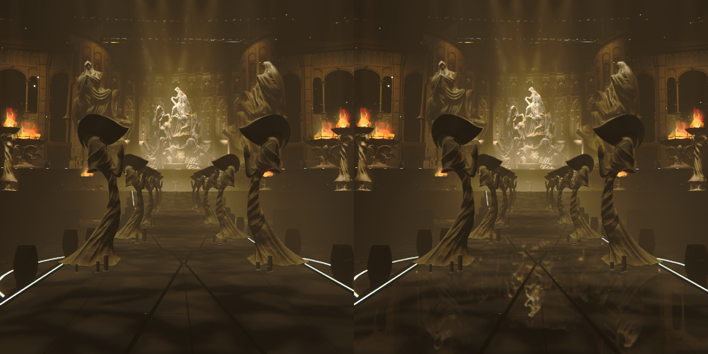
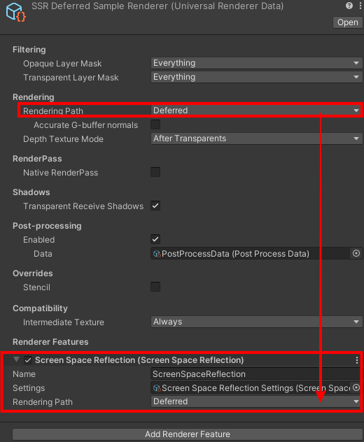
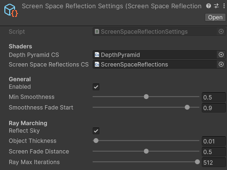
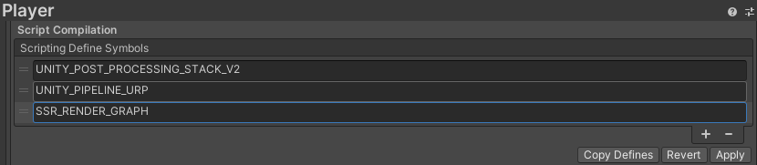

# Universal ScreenSpace Reflection

This repository is ported from Unity HDRP ScreenSpace Reflection.

This package is available on URP from 2022.3.0f1 (2022 LTS) version.
The RenderGraph path for Unity6 is also supported.

||2022 LTS|2023|Unity 6|
|:---:|:---:|:---:|:---:|
|URP Compatibility|O|O|O|
|RenderGraph Implementation|X|X|O|

## How To Use

1. Add `ScreenSpaceReflection` renderer feature to the `Renderer Data` asset. (Disable `Native RenderPass` in this asset if visible.)
2. Set the rendering path to your rendering mode.
3. Link the settings asset to the renderer feature.
(You can create the settings asset via `Create/UniversalSSR/Settings`.)

    

NOTE) If you are using `RenderGraph` in Unity 6, add `SSR_RENDER_GRAPH` define to the `Project > Player > Script Compilation`.

### In Forward(+) Rendering Mode

Since the URP Default Lit shader does not save the smoothness value to the normal texture in Forward Rendering, we need to customize `DepthNormalsPass`. It also means that we need to customize all shaders that we want to draw the reflection for forward.

However, it's pretty simple to handle this with a custom shader that stores the smoothness value into `_CameraNormalsTexture.a`.
See the reference shader(`SSRForwardLit.shader`) in the sample project.

Note) Unfortunately, shaders created with `ShaderGraph` are not supported as there's no way to customize the `DepthNormalsPass` without customizing the URP package.

## Limitations

1. XR Not supported.
2. Transparent Objects Not supported.
3. ShaderGraph shaders are not reflected in Forward(+) rendering.

## Differences from HDRP

1. Assume SSR_APPROX keyword is enabled. (No support PBR Accumulation mode due to performance.)
2. Stencil Check is excluded.
3. ClearCoatMask is excluded since it's only in HDRP.
4. Motion Vector is excluded.
