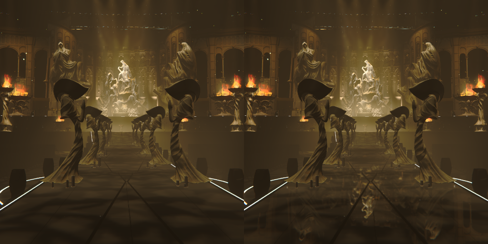
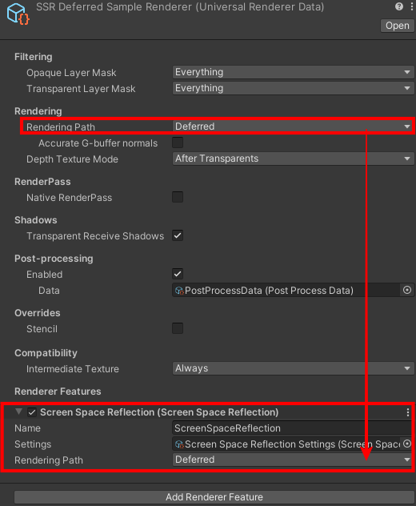
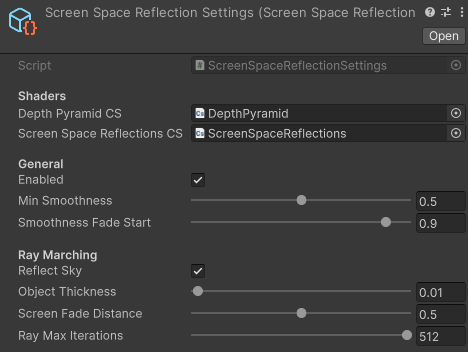

# Universal ScreenSpace Reflection

This repository is ported from Unity HDRP ScreenSpace Reflection.

This package is available on URP from 2022.3.0f1 (2022 LTS) version.
The RenderGraph path for Unity6 is also supported.

||2022 LTS|2023|Unity 6|
|:---:|:---:|:---:|:---:|
|URP Compatibility|O|O|O|
|RenderGraph Implementation|X|X|O|

## How To Use

1. Add the `ScreenSpaceReflection` renderer feature to the `Renderer Data` asset. (Disable `Native RenderPass` in this asset if visible.)
2. Set `Rendering Path` on the renderer feature to match your renderer's rendering mode (Forward / Forward+ / Deferred).
3. The compute shader / resolve shader slots auto-populate via the script's default references when the feature is added. If they are empty for any reason, drag the shaders from `Packages/Universal Screen Space Reflection/Runtime/Shaders` manually.
4. Add a `Volume` (Global or Local) to the scene, assign a Volume Profile, and click **Add Override → Lighting → Screen Space Reflection (URP)**. Toggle the `Enabled` override **on** — without this override the renderer feature stays dormant and SSR will not render.

    

All tunable parameters (`Min Smoothness`, `Smoothness Fade Start`, `Reflect Sky`, `Object Thickness`, `Screen Fade Distance`, `Ray Max Iterations`) live on the Volume override and can be authored per-scene/area, blended between Local Volumes, and overridden in cinematic profiles.

### In Forward(+) Rendering Mode

Since the URP Default Lit shader does not save the smoothness value to the normal texture in Forward Rendering, we need to customize `DepthNormalsPass`. It also means that we need to customize all shaders that we want to draw the reflection for forward.

However, it's pretty simple to handle this with a custom shader that stores the smoothness value into `_CameraNormalsTexture.a`.
See the reference shader(`SSRForwardLit.shader`) in the sample project.

Note) Unfortunately, shaders created with `ShaderGraph` are not supported as there's no way to customize the `DepthNormalsPass` without customizing the URP package.

## Migration: 1.0.x → 1.1.0

The renderer feature was refactored to use the URP Volume framework for tunable parameters. The legacy `ScreenSpaceReflectionSettings` ScriptableObject is now `[Obsolete]` and is no longer read by the renderer feature.

If you are upgrading an existing project:

1. Open your renderer asset and inspect the `ScreenSpaceReflection` feature. The old `Settings` slot is gone — three new slots (`Depth Pyramid CS`, `Screen Space Reflections CS`, `Resolve Shader`) take its place. Re-add the renderer feature, or drag the three shaders in by hand.
2. Add a Volume (Global or Local) to your scene, attach a Volume Profile, and add the **Lighting / Screen Space Reflection (URP)** override. Copy the values from your old `Screen Space Reflection Settings.asset` into the override and toggle `Enabled` **on**.
3. The legacy `Screen Space Reflection Settings.asset` can be deleted once you have copied its values.

## Limitations

1. XR Not supported.
2. Transparent Objects Not supported.
3. ShaderGraph shaders are not reflected in Forward(+) rendering.

## Differences from HDRP

1. Assume SSR_APPROX keyword is enabled. (No support PBR Accumulation mode due to performance.)
2. Stencil Check is excluded.
3. ClearCoatMask is excluded since it's only in HDRP.
4. Motion Vector is excluded.
